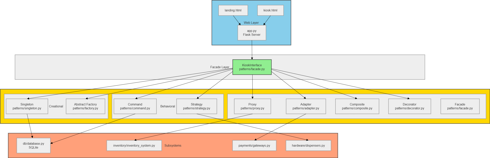
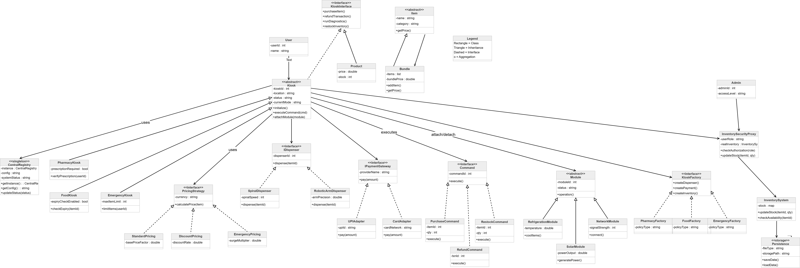
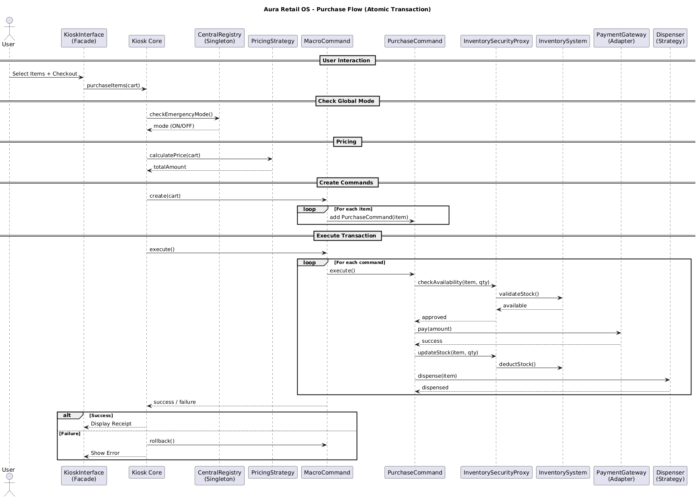
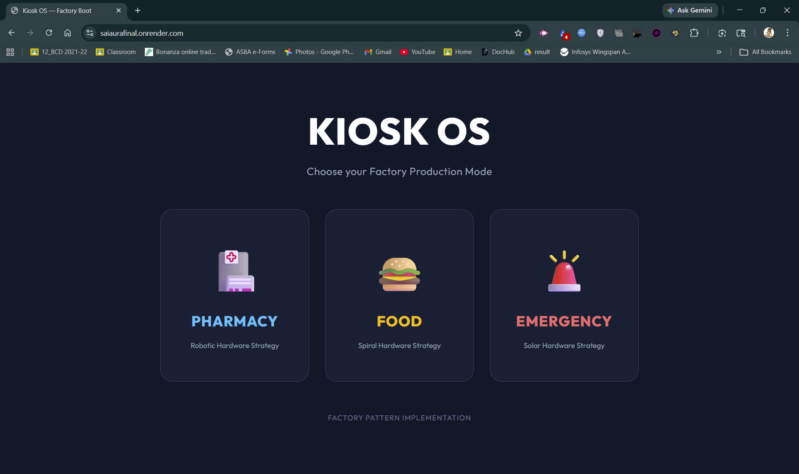
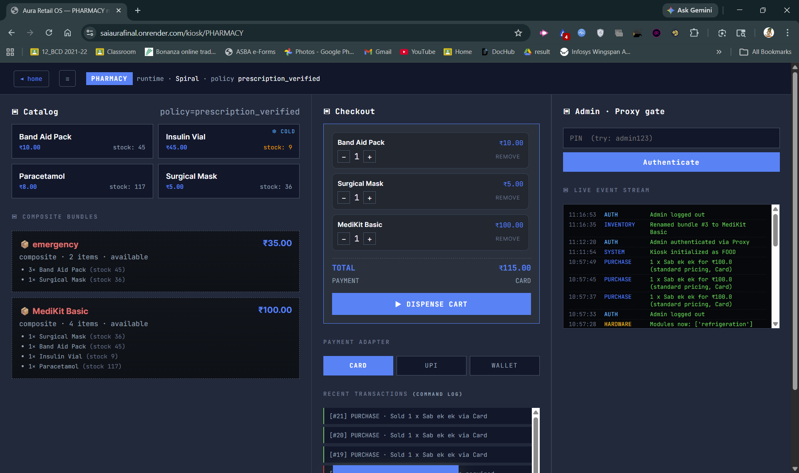
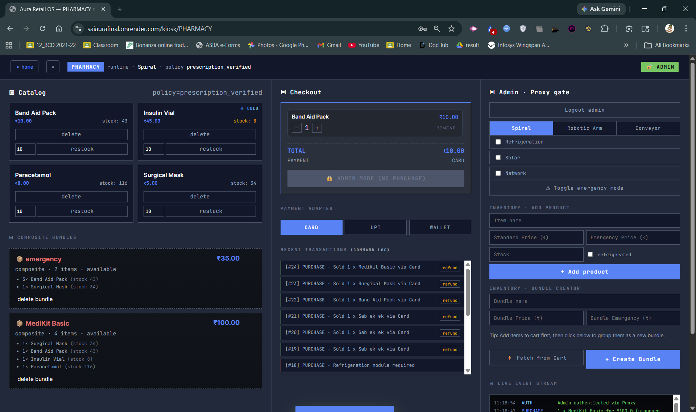
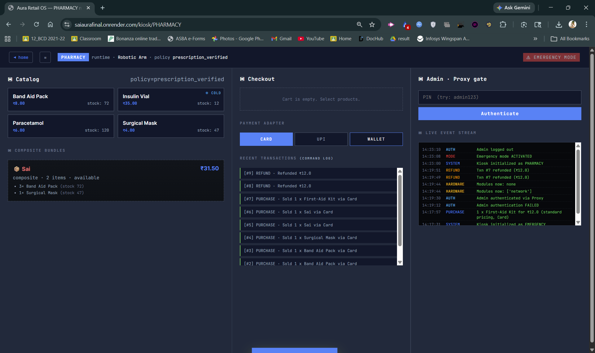

# Aura Retail OS 🏪
### Autonomous Modular Smart-City Retail Infrastructure

> **Course:** Object Oriented Programming (IT620) | **Path:** B — Modular Hardware Platform  
> **Team:** 404 Not Found! | **Group ID:** 16  
> **Instructor:** Prof. Sourish Dasgupta

---

## 🌐 Live Demo

> **Hosted on Render:** [https://saiaurafinal.onrender.com/](https://saiaurafinal.onrender.com/)

⚠️ *First load may take 30–60 seconds if the server is sleeping (free tier cold start).*

---

## 📌 Overview

Aura Retail OS is a modular, hardware-agnostic retail kiosk platform designed for the smart city of **Zephyrus**. The system powers autonomous kiosks deployed across hospitals, metro stations, university campuses, and disaster zones — each running on the same physical hardware but operating under different policies, products, and security rules.

Built using **9 OOP design patterns**, the system achieves low coupling, full hardware extensibility, and atomic transaction safety without modifying core logic when requirements change.

---

## 👥 Team Members

* **Megha Lalwani - 202512054** *(Group Leader)*
* **Yash Gangwani - 202512048**
* **Bhavika Sainani - 202512053**
* **Harshil Dodwani - 202512044**

---

## 🏗️ System Architecture

The system is divided into 5 major subsystems:

| Subsystem | Responsibility |
|---|---|
| **Kiosk Core System** | User interaction, kiosk boot, operational modes |
| **Inventory System** | Products, bundles, stock management via Composite + Proxy |
| **Payment System** | Unified payment interface via Adapter pattern |
| **Hardware Abstraction Layer** | Dispenser strategies, optional module decorators |
| **Central Registry** | Global config, system state, admin session (Singleton) |

### Architecture Diagram


### Class Diagram


### Sequence Diagram


---

## 🚀 How to Run

### Prerequisites
- Python 3.10+
- Install dependencies:
```bash
pip install -r requirements.txt
```

### Running the Application
```bash
python app.py
```

Then open your browser at: **`http://localhost:5000`**

### Selecting a Kiosk Mode
The landing page (`/`) lets you select a kiosk type:
- **Pharmacy Kiosk** — prescription medication with verification
- **Food Kiosk** — daily essentials for metro commuters
- **Emergency Relief Kiosk** — emergency supply distribution

Each mode boots with its own factory, hardware config, and inventory.

---

## ✨ Features

### Core Features
- **Multi-Mode Kiosk Boot** — Abstract Factory selects kiosk type and creates all compatible components at startup
- **Multi-Item Cart** — Add multiple products/bundles, adjust quantities, remove items before checkout
- **MacroCommand Checkout** — Entire cart processed as one atomic transaction; if any item fails, it is handled gracefully
- **Composite Bundles** — Products grouped into smart kits (e.g., Disaster Relief Kit); nested bundles supported
- **Secure Admin Panel** — All sensitive inventory operations (rename item, change price, update stock, delete, restock) locked behind an Admin PIN via Proxy; normal users cannot access these controls
- **Global Emergency Mode** — Toggle switches the entire kiosk to emergency pricing instantly
- **Hardware Module Management** — Attach or detach Refrigeration, Solar, and Network modules at runtime
- **Interchangeable Dispensers** — Switch between Spiral, Robotic, or Conveyor dispenser at runtime
- **Live Event/Audit Log** — Every system action (auth, hardware change, inventory update) is logged in real time
- **Persistent Transaction History** — All purchases and refunds stored in SQLite database
- **Dynamic Bundle Creator** — Admin can group items into a new bundle on the fly from the UI
- **Unified Payment Interface** — Card, UPI, and Wallet payments handled through a common adapter

---

## 📸 Screenshots

### Landing Page — Kiosk Mode Selection


### Customer Side — Product Catalog & Cart


### Admin Panel — Inventory Management


### Emergency Mode — Dynamic Pricing Active


---

## 🧩 Implemented Design Patterns

### Creational Patterns

#### 1. Abstract Factory
**File:** `patterns/factory.py`  
Creates kiosk-specific families of components (Dispenser, PaymentGateway, InventoryPolicy) without exposing creation logic. Adding a new kiosk type requires only a new factory — no existing code changes.

```
KioskFactory (abstract)
├── PharmacyFactory  → PrescriptionDispenser, CardAdapter, PharmacyInventory
├── FoodFactory      → SpiralDispenser, UPIAdapter, FoodInventory
└── EmergencyFactory → RoboticDispenser, WalletAdapter, EmergencyInventory
```

#### 2. Singleton
**File:** `patterns/singleton.py`  
`CentralRegistry` maintains a single global instance throughout the application. Stores admin session state, emergency mode flag, system configuration, and the live event log.

---

### Structural Patterns

#### 3. Facade
**File:** `patterns/facade.py`  
`KioskInterface` is the only entry point for external systems. It exposes four clean operations — `purchaseItem()`, `refundTransaction()`, `runDiagnostics()`, `restockInventory()` — hiding all internal subsystem complexity behind a single unified API.

#### 4. Composite
**File:** `patterns/composite.py`  
Inventory items follow a uniform `Item` interface regardless of whether they are individual products or bundles. Bundles recursively compute price and availability from their children, supporting arbitrarily nested structures.

```
Item (abstract)
├── Product  (leaf)  → single item with price and stock
└── Bundle (composite) → contains Products or other Bundles
```

#### 5. Proxy
**File:** `patterns/proxy.py`  
`InventorySecurityProxy` sits in front of the real `InventorySystem`. All write operations — **rename**, **price update**, **stock update**, **restock**, and **delete** — are intercepted; the proxy verifies an active admin session and writes an audit entry before forwarding or rejecting the call. Regular users can only read inventory; they cannot modify it in any way.

#### 6. Decorator
**File:** `patterns/decorator.py`  
Optional hardware modules are wrapped around the base `KioskUnit` at runtime without modifying the kiosk class. Each decorator adds to `status()` and `capabilities()` output transparently.

```
KioskUnit
└── RefrigerationDecorator
    └── SolarDecorator
        └── NetworkDecorator
```

#### 7. Adapter
**File:** `patterns/adapter.py`  
Each payment provider has a different API. Adapters (`UPIAdapter`, `CardAdapter`, `WalletAdapter`) convert provider-specific calls into the common `IPaymentGateway.pay()` interface, so the payment flow never needs to change when a new provider is added.

---

### Behavioral Patterns

#### 8. Strategy
**Files:** `patterns/strategy.py`, `hardware/dispensers.py`  
Two independent strategy families:
- **Pricing Strategy** — `StandardPricing` vs `EmergencyPricing`; switched instantly when emergency mode is toggled
- **Dispenser Strategy** — `SpiralDispenser`, `RoboticDispenser`, `ConveyorDispenser`; swappable at runtime without changing business logic

#### 9. Command
**File:** `patterns/command.py`  
Every user action is encapsulated as a command object implementing a common interface.

| Command | Action |
|---|---|
| `PurchaseCommand` | Deducts stock, processes payment, triggers dispenser |
| `RefundCommand` | Reverses a transaction and restores stock |
| `RestockCommand` | Adds inventory via the security proxy |
| `MacroCommand` | Batches multiple commands for cart checkout |

Commands are logged automatically and support rollback on failure.

---

## 🔒 System Constraints

| Constraint | How It's Enforced |
|---|---|
| Atomic Transactions | `MacroCommand` + rollback on failure |
| Inventory Consistency | Stock only updated on successful command execution |
| Emergency Purchase Limit | Emergency pricing strategy enforces per-user quantity caps |
| Hardware Dependency | Products requiring refrigeration are marked unavailable if that decorator is absent |
| Concurrent Overselling | Inventory checks happen inside the command before dispatch |
| Secure Admin Access | Proxy blocks all sensitive operations without an active admin session |

---

## 📁 Project Structure

```
aura_retail_os/
│
├── app.py                        # Entry point — Flask app, routes
├── requirements.txt
├── README.md
│
├── patterns/                     # All 9 OOP design patterns
│   ├── adapter.py                # Adapter — payment gateway unification
│   ├── command.py                # Command — PurchaseCommand, RefundCommand, MacroCommand
│   ├── composite.py              # Composite — Item, Product, Bundle hierarchy
│   ├── decorator.py              # Decorator — optional hardware modules
│   ├── facade.py                 # Facade — KioskInterface (single entry point)
│   ├── factory.py                # Abstract Factory — kiosk + component creation
│   ├── proxy.py                  # Proxy — InventorySecurityProxy (admin auth)
│   ├── singleton.py              # Singleton — CentralRegistry
│   └── strategy.py              # Strategy — pricing & dispenser strategies
│
├── hardware/
│   └── dispensers.py             # Spiral, Robotic, Conveyor dispenser implementations
│
├── inventory/
│   └── inventory_system.py       # Real inventory subject (used by proxy)
│
├── kiosks/                       # Kiosk type definitions
│
├── payments/
│   └── gateways.py               # Raw payment provider APIs (UPI, Card, Wallet)
│
├── db/
│   └── database.py               # Database models and transaction history
│
├── subsystems/                   # Supporting subsystem logic
│
├── commands/                     # Command objects and macros
│
├── data/
│   └── aura.db                   # SQLite database (inventory + transactions)
│
├── screenshots/                  # UI screenshots for README
│   ├── architecture.png
│   ├── class_diagram.png
│   ├── landing.png
│   ├── customer.png
│   ├── admin.png
│   └── emergency.png
│
├── templates/
│   ├── landing.html              # Kiosk mode selection page
│   └── kiosk.html                # Main kiosk UI
│
└── static/
    ├── css/
    │   └── app.css               # Glassmorphism UI styles
    └── js/
        └── app.js                # Frontend state sync and interactions
```

---

## 🧪 Simulation Scenarios

### Scenario 1 — Adding a New Hardware Module
1. Boot any kiosk
2. From admin panel, attach `RefrigerationModule`
3. Observe kiosk `status()` and `capabilities()` update without any class modification
4. Refrigerated products become available in inventory

### Scenario 2 — Integrating a New Payment Provider
1. Create a new adapter implementing `IPaymentGateway`
2. Register it in the factory for the target kiosk type
3. No changes to `PurchaseCommand` or `KioskInterface`

### Scenario 3 — Nested Bundle Inventory
1. Admin creates a "Disaster Relief Kit" bundle containing a "Medical Bundle" + individual items
2. System recursively computes availability and price
3. Purchasing the kit deducts stock from all leaf products correctly

### Scenario 4 — Emergency Mode & Dynamic Pricing
1. Admin activates Emergency Mode via the toggle in the admin panel
2. `CentralRegistry` updates the global emergency flag
3. `KioskInterface` switches the active `PricingStrategy` from `StandardPricing` to `EmergencyPricing`
4. All product prices are now computed using the emergency formula — no product data is modified
5. Deactivating emergency mode instantly restores standard pricing

---

## 👥 Team & Responsibilities

| Member | Role | Patterns |
|---|---|---|
| **Megha Lalwani** (Leader) | Kiosk Core, Central Registry, Facade, Command | Singleton, Abstract Factory, Facade, Command |
| **Yash Gangwani** | Inventory System | Composite, Proxy |
| **Bhavika Sainani** | Hardware Layer | Decorator, Strategy |
| **Harshil Dodwani** | Payment System | Adapter, Strategy |

---

## 📦 Dependencies

| Library | Purpose |
|---|---|
| `Flask` | Web framework — serves kiosk UI and API routes |
| `sqlite3` | Transaction and history persistence (`aura.db`) |
| `json` | Inventory and config file storage |

> All dependencies listed in `requirements.txt`

---

*Submitted for IT620 — Object Oriented Programming | DAIICT*